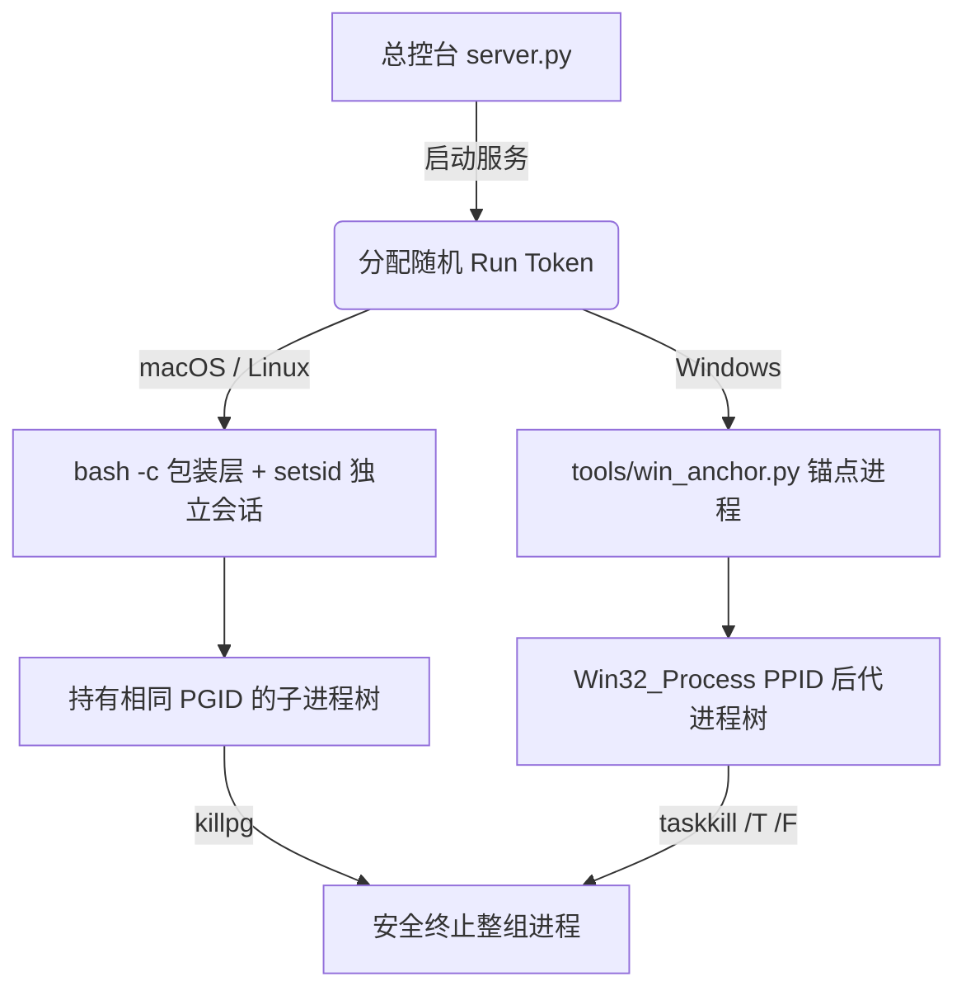

# 总控台 (Console) 系统架构与设计全景

本文档深入阐述总控台（Local Ops Console）的技术架构、核心设计哲学、前后端通信契约以及跨平台进程管理模型。

---

## 1. 核心设计哲学

1. **本地优先与回环隔离 (Local-Only & Loopback Isolation)**:
   - 服务仅绑定本地回环地址 `127.0.0.1`（默认端口 9600，被占自动递增至 9609）；
   - 杜绝暴露到公网或未受信任的网络，写操作进行严格的 Host / Origin 和当前用户 UID 校验；
   - 只服务当前机器与当前登录用户，不是多租户或远程运维控制台。

2. **零依赖极简后端 (Zero-Dependency Backend)**:
   - 后端全部代码收敛于 `server.py` 单文件（以及轻量辅助脚本 `tools/win_anchor.py`）；
   - **完全基于 Python 3.12 标准库**（`http.server`, `subprocess`, `ctypes`, `threading`, `json` 等），无需 `pip install` 任何第三方依赖。

3. **双轨静态资源服务 (Dual-Mode Static Serving)**:
   - 后端实现智能路由回退：优先扫描并提供 `frontend/dist` 下的现代 React 19 单页应用；若未构建或开发环境下缺少 `dist`，无缝平滑回退至 `static/` 原生前端；
   - 保证纯 Python 环境开箱即用，同时为现代前端开发赋能。

---

## 2. 后端架构设计 (`server.py`)

### 2.1 HTTP 服务器与网络模型
- 基于 Python 标准库 `http.server.ThreadingHTTPServer`，多线程并发响应前端轮询与控制指令；
- **Keep-Alive 连接保护**：所有无返回体的 POST/PUT 路由（如启动/停止）均严格执行 `discard_body()`，防止残留字节污染 Keep-Alive 连接导致下一个 GET 请求解析失败；
- **配置持久化原子写入**：使用线程锁保护，落盘采用临时文件写入 + `os.replace` 原子替换，并在写入前自动备份上一版本至 `config.json.bak`，防止意外断电或并发写损坏配置。

### 2.2 核心 REST API 契约

| 接口 | 方法 | 语义与描述 |
| :--- | :--- | :--- |
| `/api/state` | `GET` | **前端唯一高频轮询接口**（每 2 秒一次）。返回全量服务列表、关注进程、应用卡片、端口占用对账、降级状态与主题配置。 |
| `/api/health` | `GET` | **超轻量探活检查**。不执行 `ps/lsof/netstat` 系统扫描，用于快速判断服务健康度与配置状态。 |
| `/api/project/detect` | `POST` | **只读项目识别**。传入目录路径，识别 `package.json` scripts、Hexo、FastAPI/Flask、Go、Rust、静态站等启动命令与端口，不执行代码、不装依赖。 |
| `/api/apps` | `POST` | 创建应用卡片。支持通过 `attachPid` 携带当前监听的外部进程，后端原子完成卡片创建与进程认领。 |
| `/api/apps/{id}/start` | `POST` | 启动受控进程。先进行健康预检（PATH/工作目录/权限校验），通过后分配随机 Run Token 并派生独立进程组。 |
| `/api/apps/{id}/stop` | `POST` | 停止受控进程。仅对持有合法 Token 的受控进程组发送终止信号，**绝不按端口误杀外部进程**。 |
| `/api/apps/{id}/restart` | `POST` | 优雅重启。安全停止旧进程并确认退出后，拉起新进程实例。 |
| `/api/apps/{id}/diagnose` | `POST` | 本地规则智能诊断。分析依赖缺失、端口冲突、启动命令配置错误及非零退出码。 |
| `/api/kill` | `POST` | 强制或优雅结束指定 PID 进程（严格限制在当前用户所属进程）。 |
| `/api/console/restart` | `POST` | 总控台自身热重启，派生独立 Helper 进程并在旧进程退出后复用端口重新绑定。 |

---

## 3. 受控进程与生命周期模型

### 3.1 卡片类型区分 (`kind`)
* **长期服务 (`service`)**:
  - 具备端口监听语义，主操作为「启动」/「停止」；
  - 手动停止不记录历史；异常退出时保留错误退出信息。
* **批处理任务 (`task`)**:
  - 端口强制为 `null`，主操作为「运行」/「中止」；
  - 采用**四态任务退出协议**：
    - `succeeded`: 自然退出，退出码为 `0`；
    - `canceled`: 脚本内部主动取消，退出码为 `130`；
    - `failed`: 异常失败，退出码为非 0 且非 130；
    - `stopped`: 用户在总控台主动点击「中止」（code 为 `null`）。

### 3.2 跨平台进程所有权与隔离


- **macOS/Linux**: 通过 `setsid()` 创建独立进程组（Process Group），所有子进程继承 PGID。停止时使用 `os.killpg(pgid, SIGTERM)`。
- **Windows**: Windows 无进程组机制，总控台通过 `tools/win_anchor.py` 锚点进程包装临时脚本，利用 WMI/CIM 遍历该锚点的整棵后代进程树（PPID 追踪），停止时通过 `taskkill /T /F` 级联终止整棵树。

### 3.3 进程溯源引擎 (Origin Attribution)
总控台内置高效溯源算法，对监听端口的进程沿着 PPID 链向上追溯（最多 12 层）：
- 识别常见 **AI 编程助手**（Claude Desktop, Cursor, Codex, Kimi, Gemini, Aider 等）；
- 识别主流 **IDE / 编辑器**（VS Code, JetBrains, Sublime 等）；
- 识别各种 **终端模拟器**（iTerm2, Warp, Windows Terminal, CMD, PowerShell）；
- 识别总控台自启动进程（标记为「总控台」）。

---

## 4. 前端现代化工程架构 (`frontend/`)

前端基于 React 19 + TypeScript + Vite + Tailwind CSS v4 重构，整体分层清晰：

```
frontend/src/
├── types/              # 强类型定义层 (console.ts)
├── services/           # 网络通信与纯工具层 (api.ts, ports.ts)
├── hooks/              # 响应式状态管理 (useConsoleState, useTheme)
├── context/            # 全局 UI 调度上下文 (ModalContext, ToastContext)
├── components/
│   ├── layout/         # 外壳结构 (Shell, RailNav, TopBar)
│   ├── launchpad/      # 启动台视图 (LaunchpadView, AppCard, 诊断弹窗)
│   ├── services/       # 服务监控视图 (ServicesView, ServiceRow, 端口发现)
│   ├── widgets/        # 右侧信息边栏 (ActivityFeed, TopResources, QuickActions)
│   └── overlays/       # 模态与抽屉 (AppEditModal, LogDrawer, CmdkModal)
└── styles/             # 主题与全局样式 (globals.css, themes.css)
```

### 核心特性
- **增量 DOM 渲染**：基于唯一的 `instanceKey` (`pid:port`) 和 `id` 进行局部更新，杜绝轮询时的整列表重绘与视觉闪烁；
- **状态闪回保护 (Epoch Guard)**：当用户发起启停操作后，本地状态代际 `mutationEpoch` 递增，自动丢弃在此之前发出的过期轮询快照，确保交互即时响应；
- **深浅色 Ops 指挥台主题**：内置蓝黑/雾灰工业级配色，支持跟随系统与手动一键切换。
